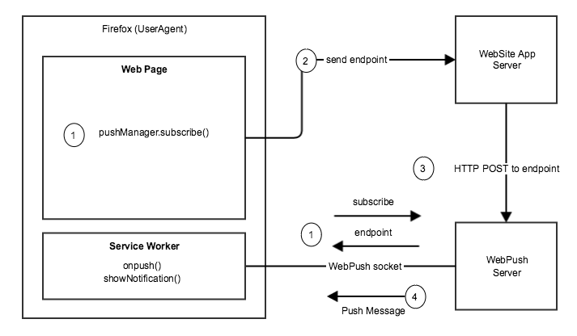

# PWA Web Push Notification
This application is the implementation of PWA Web push via Angualar [SwPush](https://angular.io/api/service-worker/SwPush) of service-worker. When server wants to notify their client in offlin mood web push is important. 

## How Web push works

Before getting into the API, let’s look at push from a high level, start to finish. Then as we step through specific topics or APIs, you’ll understand how it fits into the overall story of web push.

The three steps to implementing push are:

1. Adding the client-side logic to subscribe a user to push. Subscribing the user requires gaining permission to display notifications using the Notifcations and Permissions APIs followed by requesting a **PushSubscription** using the [Push API](https://developer.mozilla.org/en-US/docs/Web/API/Push_API).
    
1. The API call from your backend/application that triggers a push message to a user’s device.
    
1. The service worker JavaScript file that receives “push events” when the push arrives on the device. It’s in this JavaScript that you’ll show a notification.

Workflow of web push. ([Source](https://wiki.mozilla.org/File:PushNotificationsHighLevel.png))

## Implementation 
We will implement each steps of the figure above.

### Application
The application that will run in UserAgents (i.e. Firefox, Chrome etc.) is implemented using **Ionic Angular**. There are two main parts: 

1. **User subsciption**: Angular [SwPush](https://angular.io/api/service-worker/SwPush) to subcribe for push notification. I discussed how we can generate valid **SERVER_KEY** in **WebSite App Server** implementation part. Follow the file `explore-container.component.ts` for details about subcription.

2. **Service Worker**: This is the only point we can directly handle the push notifications while PWA application will be in background or closed. By the following code sample I handle several things on **notificationclick**. Follow the `/customer-service-worker.js` file for details. 

- Oncliking onEnsured that only single instance of this application will run at a time.
- Focus the application if its not active.
- Navigate to given URL

3. Run application command: We have to run the application in production mood. the following command is importat to run the application in prod mood.

       $ npm run start-pwa

4. References 
    
    - https://angular.io/api/service-worker/SwPush
    - https://stackoverflow.com/questions/45150642/check-if-window-is-active-from-service-worker
    - https://developers.google.com/web/fundamentals/codelabs/push-notifications/
    - https://stackoverflow.com/questions/54138763/open-pwa-when-clicking-on-push-notification-handled-by-service-worker-ng7-andr

### WebPush Server
Used **TypeScript** and **Express** to implement this part. It has actullay four parts.

1. **Generate Valid Server Keys**: Used the [npmjs web-push](https://www.npmjs.com/package/web-push) to generate public and private key value pair.
2. **Configure Web Push VapidDetails**: `config/webpush.ts` contains related configs.
3. **Store Subcriptions** : The file `SubscriptionStoringService.ts` described about subscription storing. We used in-memory-database, We have to use real database ure.
4. **Broadcaset Message to subscribers**: Follow the file called `SubscriptionBroadcastService.ts` for detailed implementation. 

#### Run the server: 

        $ cd server
        $ node .

 ### Reference: 
 - https://www.npmjs.com/package/web-push
 - https://expressjs.com/en/5x/api.html

